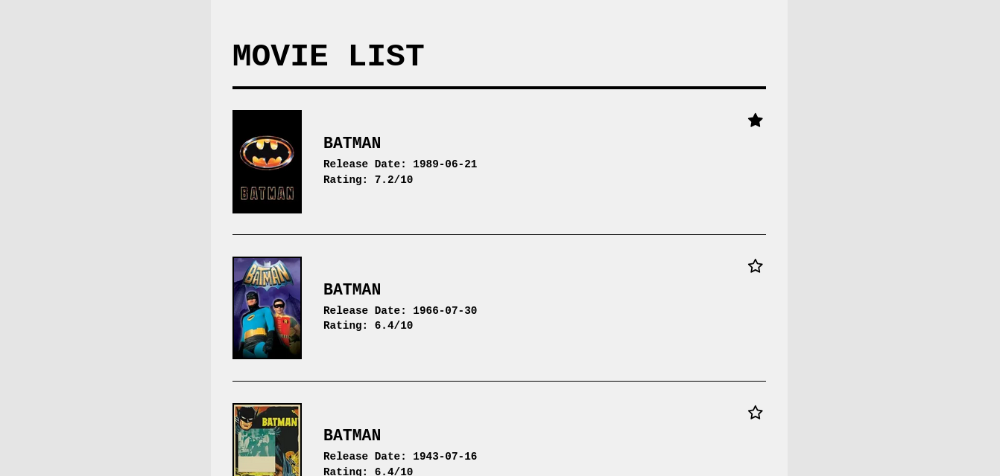
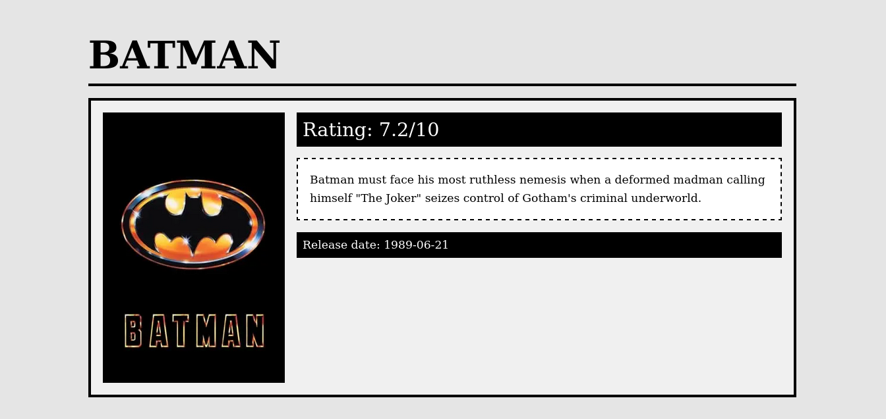

# MovieApp

## Description
A movie listing app where users can search for movies, view details, and add favorites.

## Images 




## Installation
1. Clone the repository:

```bash
    git clone <repository-url>

    bun install

    bun run rev
```

## Features
- Search for movies from tmdb
- Add movies to favorites (stored in local storage).

## Technologies 
- Next.js
- TMDB API
- LocalStorage

## Author 
- [Alhussien Ahmed](https://github.com/donRehan)
